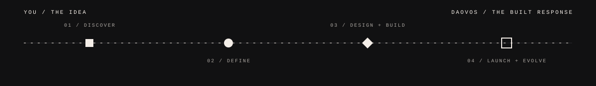

<div align="center">
  
</div>

<br />

<div align="center">
  <a href="mailto:daovos.corp@gmail.com">
    
  </a>
  
</div>

<br />

## We turn ambitious ideas into clear digital experiences.

DAOVOS is an independent digital studio designing and engineering distinctive websites, interfaces, and commerce experiences. We bring strategy, visual direction, interaction, and development into one connected build—so an idea does not lose its character on the way to becoming real.

> **You bring the idea. DAOVOS turns it into a digital experience.**

<br />

<table>
  <tr>
    <td width="58%" valign="top">
      <sub>01 / WHO WE ARE</sub>
      <h3>Premium without being inaccessible.</h3>
      <p>We work with startups, growing businesses, creators, personal brands, and ambitious teams that want more than a generic template. Every engagement is shaped around the message, the audience, and the way the business needs to move.</p>
    </td>
    <td width="42%" valign="top">
      <sub>OUR OPERATING PRINCIPLES</sub>
      <p><strong>STRUCTURE</strong> before decoration.<br />
      <strong>CLARITY</strong> before complexity.<br />
      <strong>MOTION</strong> with purpose.<br />
      <strong>SYSTEMS</strong> built to evolve.</p>
    </td>
  </tr>
</table>

<br />

## What we build

<table>
  <tr>
    <td width="50%" valign="top">
      <sub>01 / DIGITAL HOMES</sub>
      <h3>Custom websites</h3>
      <p>Complete digital homes shaped around the brand, its audience, and the way it needs to grow.</p>
      <code>STRATEGY</code> <code>UI/UX</code> <code>DEVELOPMENT</code>
    </td>
    <td width="50%" valign="top">
      <sub>02 / ONE DECISIVE ROUTE</sub>
      <h3>Landing experiences</h3>
      <p>Focused pages for launches, campaigns, products, and ideas that need one message to land clearly.</p>
      <code>CAMPAIGNS</code> <code>LAUNCHES</code> <code>CONVERSION</code>
    </td>
  </tr>
  <tr>
    <td width="50%" valign="top">
      <sub>03 / COMMERCE INFRASTRUCTURE</sub>
      <h3>Commerce systems</h3>
      <p>Storefronts where identity, product discovery, and buying flow operate as one considered system.</p>
      <code>STOREFRONTS</code> <code>PRODUCT FLOWS</code> <code>OPTIMIZATION</code>
    </td>
    <td width="50%" valign="top">
      <sub>04 / INTERFACE ARCHITECTURE</sub>
      <h3>Interface systems</h3>
      <p>Responsive product interfaces and visual systems designed for consistency at every scale.</p>
      <code>DESIGN SYSTEMS</code> <code>RESPONSIVE UI</code> <code>PROTOTYPES</code>
    </td>
  </tr>
  <tr>
    <td width="50%" valign="top">
      <sub>05 / CONTINUOUS CARE</sub>
      <h3>Redesign and evolution</h3>
      <p>Sharper structure, better performance, and ongoing improvement for digital products already in motion.</p>
      <code>REDESIGN</code> <code>MAINTENANCE</code> <code>SCALE</code>
    </td>
    <td width="50%" valign="top">
      <sub>EXPANDING FIELD</sub>
      <h3>Beyond the website</h3>
      <p>Brand identity, creative direction, web applications, automation, and digital products as DAOVOS grows.</p>
      <code>IDENTITY</code> <code>SOFTWARE</code> <code>AUTOMATION</code>
    </td>
  </tr>
</table>

<br />

<div align="center">
  
</div>

<br />

## One continuous build

| Field | What happens |
| :--- | :--- |
| **Discover** | We find the real objective, audience, constraints, and opportunity. |
| **Define** | We turn the brief into structure, hierarchy, content direction, and a decisive route. |
| **Design** | We create a visual and interaction system with a distinct point of view. |
| **Build** | We engineer the responsive experience, motion, performance, and integrations. |
| **Launch** | We test, refine, release, and leave the system ready to evolve. |

<br />

## The current system

This profile also houses the source for the current DAOVOS digital experience—a motion-led React site where the studio's identity is expressed through procedural geometry, architectural grids, monochrome material, and carefully paced transitions.

<div align="left">
  
  
  
  
</div>

<details>
  <summary><strong>Inside the visual operating system</strong></summary>
  <br />

  - A procedural six-module 3D emblem built with custom Three.js geometry and shaders.
  - A cinematic opening sequence and choreographed plane transitions.
  - A pinned studio manifesto and horizontal geometric service atlas.
  - A strict bone-white and near-black palette with editorial typography.
  - Motion designed around precision, legibility, and reduced-motion support.

  ```bash
  npm install
  npm run dev
  ```
</details>

<br />

## The standard

<table>
  <tr>
    <td align="center"><strong>STRUCTURE</strong><br /><sub>Every decision has a reason.</sub></td>
    <td align="center"><strong>PRECISION</strong><br /><sub>Details survive the build.</sub></td>
    <td align="center"><strong>MODULARITY</strong><br /><sub>Systems remain useful as they grow.</sub></td>
  </tr>
  <tr>
    <td align="center"><strong>RELIABILITY</strong><br /><sub>The experience works in the real world.</sub></td>
    <td align="center"><strong>SCALE</strong><br /><sub>Built for the next stage, not only today.</sub></td>
    <td align="center"><strong>PROGRESS</strong><br /><sub>Launch is a starting point.</sub></td>
  </tr>
</table>

<br />

<div align="center">
  <sub>AVAILABLE FOR SELECTED COMMISSIONS</sub>
  <h2>Have an idea worth building?</h2>
  <p>Tell us what you are creating, where it needs to go, and what currently stands in the way.</p>
  <a href="mailto:daovos.corp@gmail.com"><strong>START A PROJECT →</strong></a>
  <br /><br />
  <code>daovos.corp@gmail.com</code>
</div>

<br />

---

<div align="center">
  <sub>DAOVOS / DESIGN · BUILD · SCALE / 2026</sub>
</div>
